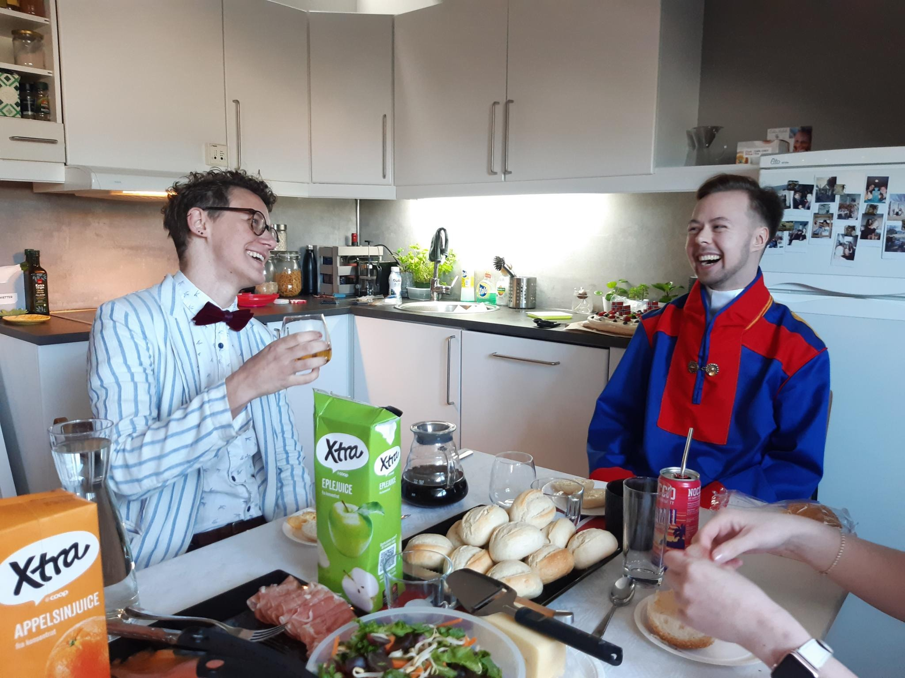

# Velkommen til Queer Hangout!

**Queer Hangout** er en møteplass for skeive voksne i Drammen, og en frivillig organisasjon som møtes fast en gang i måneden. Iblant har vi også aktiviteter som bursdager, juleverksted, skogsturer eller frokost på 17.mai.  
  
Queer Hangout er ikke bare en vennegjeng, men også en gruppe aktivister som jobber mot ensomhet i det skeive miljøet. Blant annet er mange funksjonshemmede utelatt av det skeive miljøet pga. manglende tilrettelegging. Vi har derfor bygget en egen rullestolrampe, ordnet stillerom og valgt tilrettelagte lokaler, sånn at funksjonshemmede kan bli med i Queer Hangout på lik linje som alle andre. Vi samarbeider med hvert medlem og relevante organisasjoner, sånn at vi får gjort ting riktig.  

[Trykk her for å lære mer om våre mål og hvordan **du** kan hjelpe!](/vaare-maal)
  
  
