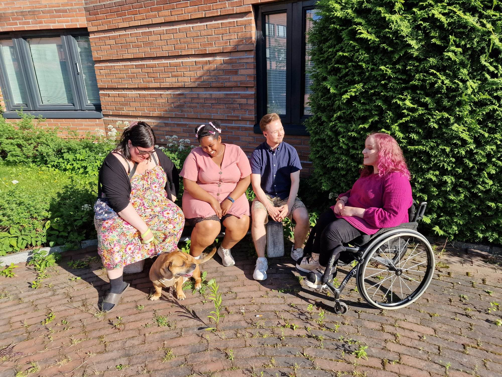

# Om Oss

**Queer Hangout** er en møteplass for skeive voksne i Drammen, og en frivillig organisasjon som møtes to ganger i måneden. Vi har også en egen facebookgruppe hvor folk kan legge ut egne aktiviteter, som bursdager, juleverksted, skogsturer eller frokost på 17.mai. 

Queer Hangout er ikke bare en vennegjeng, men også en gruppe aktivister som jobber mot ensomhet i det skeive miljøet. Blant annet er mange funksjonshemmede utelatt av det skeive miljøet pga. manglende tilrettelegging. Vi har derfor bygget en egen rullestolrampe, ordnet stillerom og valgt tilrettelagte lokaler, sånn at funksjonshemmede kan bli med i Queer Hangout på lik linje som alle andre. Vi samarbeider med hvert medlem og relevante organisasjoner, sånn at vi får gjort ting riktig.  

   

## Hva vi har oppnådd

Siden 2022, da Queer Hangout var opprettet, har vi hatt:

### Skeiv Dag på Tollbugata

Til tross at vi er flere skeive organisasjoner i Drammen, så snakker vi ikke så ofte med hverandre, da vi har forskjellige demografier. Derfor arrangerte Queer Hangout "Skeiv Dag på tollbugata", en dag hvor flere skeive organisasjoner i Drammen ble invitert til å delta med bod og aktiviteter, en dag for å bygge samhold og solidaritet, og dele det med resten av strømsø. Det ble et skeivt marked, mat, smykkeverksted og ballongdyr med klovnen Abby. Arrangementet var økonomisk støttet gjennom Strømsø 2030.

Artikkel på blikk.no: <a href="https://www.blikk.no/drammen-drammen-pride-mangfold/skeiv-dag-i-drammen/249368" rel="nofollow" target="_blank">https://www.blikk.no/drammen-drammen-pride-mangfold/skeiv-dag-i-drammen/249368</a>

  

### Kos på stranden

Piknik, kubb, frisbee, musikk og bading. 2 år på rad har vi hatt en utflukt til stranden, organisert av Queer Hangout.

   

### Fast møte hver måned på Criollo Sjokoladebar

Siden August 2022, har vi hatt en fast møteplass på Criollo Sjokoladebar i Drammen. I en periode, hadde vi 2 faste møteplasser, hvor den andre var på Strømsø Knutepunkt.

  

### Skeivt retro ball

Under Drammen Pride 2023, arrangerte Queer Hangout et Skeivt Ball på Strømsø Knutepunkt, med musikk, en photobooth, gratis brus og snack og maaaaaaange ballonger.

### Innsamling for kjønnsbekreftende kirurgi

På flere markeder, jobbet Queer Hangout sammen for å samle og selge brukte klær. Det var til innsamling for en kjønnsbekreftede operasjonen til en kjernemedlem og god venn i Queer Hangout. Du kan lese mer om dette, og lære mer om kjønnsbekreftende operasjoner generelt ved [å trykke her.](/innsamling)    

  

Og det er hva vi har gjort så langt. Vi har mange flere planer for fremtiden. Om du vil lese mer om våre mål og fremtidige planer, [så kan du trykke her!](/vaare-maal)