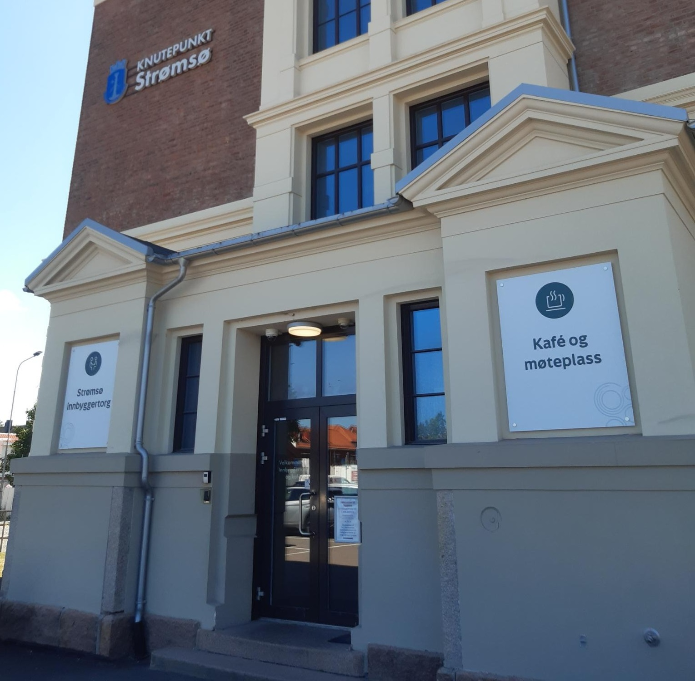

  
# Welcome to Queer Hangout in Drammen!  
  
## About us  
**Queer Hangout** is a meetingplace for gay, lesbian, trans, questioning/experimenting and other queer people in Drammen. We are a volunteer organization that meets twice a month, and also has a private facebookgroup where people plan their own activities, like birthdays, christmas workshops, forest walks and more.  

Queer Hangout is not only a friendgroup, but also a group of activists that work against loneliness in the queer community. Many feel they don't belong in the queer community, maybe because they're in a wheelchair and the venue has no ramps, or because you belong to a exposed minority like muslims or sex workers. We try to make everyone feel welcome, and work with every member and relevant organizations (Like [Skeiv Verden](https://skeivverden.no)) to achieve this.  

   

  
## Activities  

If you have allergies, dietary restrictions or other accessibility needs, feel free to contact us at [queerhangout@posteo.no](mailto:queerhangout@posteo.no) and we will do our best to accomodate you!  
  
### Strømsø Knutepunkt  
The second sunday of every month, 14:00-18:00.  
Open for all queer and questioning people. Wheelchair accecible, both normal and handicapped parking, has a quiet room if you need a break.  

  
  
### Criollo sjokoladebar  
Last Sunday of every month, 14:00-17:00.  
Open for all queer and questioning people. Wheelchair accecible, all food is vegan, has a tendency to get loud.  
  
  
  
  
### Closed events  
We have a closed facebookgroup where everyone can post their own activities. For our members safety, you have to go to one of our pulic activities before you can join our closed group.  

**We look forward to seeing you!**  

## Rules  
![The safe and inclusive space guidelines, made by Skeiv Verden. One, inclusion, everyone should be included, seen and weelcome. Two, pronouns, respect the pronoun people use. Ask if you don't know. Three, tone of communication, use respectful language, avoid jokes which can easily be misunderstood. Four, touching, ask before making physical contact. People have different needs for personal space. Five, flirting, be mindful of not crossing other people's boundaries, flirting can make some people uncomfortable. Six, privacy, everyone has a different story and can decide what they want to share about themselves. It's okay to say no. Seven, confidentiality, respect anonymity. Do not share personal information of others. Eight, cameras, photos should always be taken with consent. Nine, open mind, misunderstandings happen, take care of each other. Relax, everyone makes mistakes! Accept and or give feedback in a constructive way. And be kind, always!](../images/safespage.jpg "Used with permission by Skeiv Verden") <figcaption>Bilde brukte med tillatelse fra <a href="https://skeivverden.no">Skeiv Verden</a></figcaption>  
  
  
1. Be nice to people. Queer Hangout includes exposed minorities like muslims, sex workers, disabled people, trans people, etc. As long as you're willing to learn and be respectful, you will be fine. Bigotry will not be accepted.  
2. Only queer people can go to our events. This includes if you are unsure or exploring identities. It is 100% okay to bring an assistant or a non-queer friend for support.  
3. Ask before you contact someone outside of Queer Hangouts. Not everyone is out of the closet! Don't give out other peoples contact information without permission, even to someone else in the group.  

### Sending a warning  
If you have experienced something uncomfortable at Queer Hangout, then you can mail us at [queerhangout@posteo.no](mailto:queerhangout@posteo.no). This will only be seen by the leader of Queer Hangout, and they will handle the issue as discreetly as possible. If you have a problem with the leadership in Queer Hangout, you can contact our mother organization at [foreningen FRI.](https://www.foreningenfri.no/varsling-2)  

## Contact information  
Queer Hangout kan be contacted by e-mail: [queerhangout@posteo.no](mailto:queerhangout@posteo.no)  
Facebook: [facebook.com/queerhangout](https://facebook.com/queerhangout)  
Instagram: Coming Soon!  

If you wish to give us a donation, we would be extremly grateful!  
Dontaions can be sent via Vipps: 818416  
Or to our bankaccount: 1506.92.76013  

  
