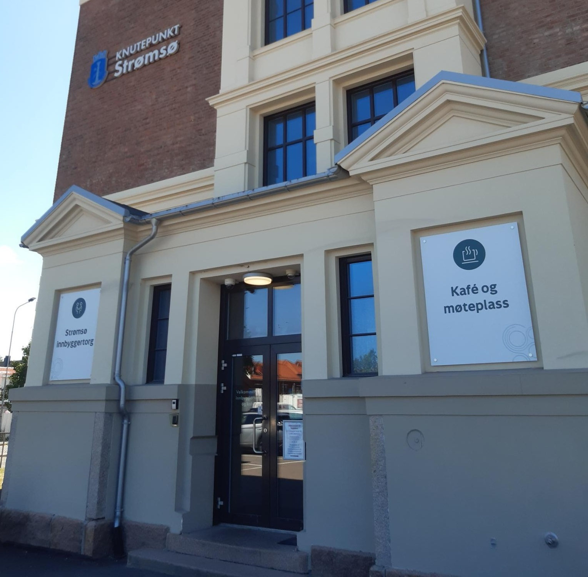

import EventsList from "../../src/components/events-list"

# Hva skjer?

[Trykk her for å lese våre regler](/regler)  
Hvis du har allergier, diett restriksjoner eller andre tilrettelegginsbehov, ta kontakt med oss på [post@queerhangout.no](mailto:post@queerhangout.no)

## Kommende arrangementer

<EventsList />

## Strømsø Knutepunkt

Andre søndagen i måneden, 14:00-18:00.  
Åpent for alle skeive. Rullestolvennlig, normal og HC parkering, har stillerom. (Rullestolbrukere har en alternativ inngang som er tilrettelagt)

## Criollo sjokoladebar

Siste søndagen i måneden, 14:00-17:00.  
Åpent for alle skeive. Rullestolvennlig, tendens til å bli høylydt.

## Lukkede arrangementer

Vi har en lukket facebookgruppe der alle kan legge ut egne aktiviteter. For våre medlemmers sikkerhet, må du først dra til et av våre offentlige arrangementer for å få tilgang.

**Hjertlig velkommen**
