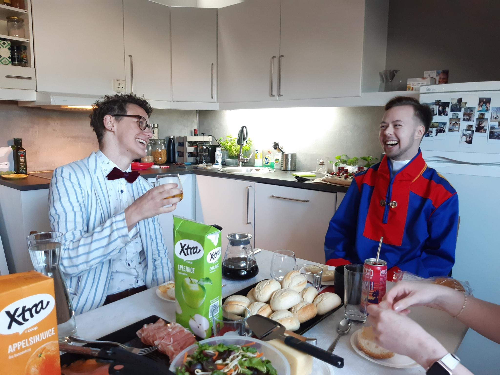

# Om oss

**Queer Hangout** er en møteplass for skeive voksne i Drammen. Vi er en frivillig organisasjon som møtes to ganger i måneden. Vi har også en egen facebookgruppe hvor folk kan legge ut egne aktiviteter, som bursdager, juleverksted, skogsturer eller frokost på 17.mai.  
  
Queer Hangout er ikke bare en vennegjeng, men også en gruppe aktivister som jobber mot ensomhet i det skeive miljøet. Blant annet er mange funksjonshemmede utelatt pga. manglende tilrettelegging. Vi har derfor bygget en egen rullestolrampe, ordnet stillerom og valgt tilrettelagte lokaler. Vi samarbeider med hvert medlem og relevante organisasjoner, sånn at vi får gjort ting riktig.  
  
  
  

  
Queer Hangout er fylt med "fiksere", så vi har klart å gjøre mye med lite. Alt, fra denne websiden til rullestolrampen, er det noen i Queer Hangout som har laget på dugnad. Men det er mye vi ikke kan gjøre uten penger, og vi setter derfor stor pris på alle donasjoner! 
  
Her er våre små og større mål.  
  
**Sunn, hjemmelaget mat**  
Skeive er mer utsatt for diskriminering i arbeidslivet, og har ofte dårligere råd enn resten av befolkningen. Vi tilbyr derfor et sunt gratis måltid på våre treff, som vi lager sammen som en sosial aktivitet. Dette er en av våre største utgifter. En donasjon på 150 kr. vil gi et måltid til alle på en Queer Hangout (gjennomsnittlig 20 personer). Man kan vippse oss på #818416, tusen takk!  
  
**Skeivt ball under pride**  
Vi skal ha et skeivt ball under Drammen Pride! Det blir som ditt gamle ungdomskoleball, men nå får du være ditt skeive selv. Fylt med fargerik pynt, gammel partymusikk, dansegulv, karaoke og en morsom fotobooth. Vi ønsker å kunne investere i pynt og annet praktisk som vi kan bruke om og om igjen, istedenfor billig pynt vi må kaste når dagen er over.  
  
**Utleie av basseng eller badstue**  
Vi har en stor andel transpersoner i Queer Hangout og de føler seg ikke trygge i garderober og svømmehaller. Mange opplever at uansett hvilket kjønn garderobe man velger, så er det noen som blir sint eller skremt. PKI (Norges pasientorganiasjon for kjønnsinkogruens) har tidligere leid en hel svømmehall eller badstue for bare transpersoner, og dette har vært en storsukksess! Vi ønsker å gjøre det samme i Drammen.  
  
**Naturgruppe**  
Vi ønsker å lage en skeiv tur- og naturgruppe. Her ønsker vi å investere i en bålpanne, stormkjøkken, fiskestanger, lommekniver og annet man trenger for naturaktiviteter.  
  
**Kurs i tegnspråk**  
Vi ønsker at så mange som mulig kan bli med, og vi vil invitere grupper som det sjeldent tilrettelegges for. En av disse gruppene er døve, så vi gjennomføre et kurs i tegnspråk for alle Queer Hangout medlemmer.  

Du kan donere til oss på vipps på nummer #818416 eller overføre til oss på kontonummer 1506.92.76013. Du kan også maile oss på queerhangout@posteo.no om du har spørsmål. Tusen takk!  
  
  

